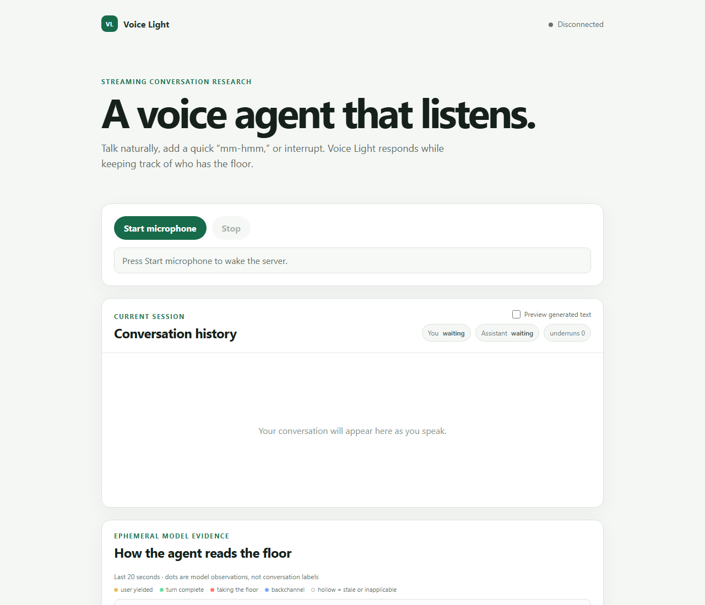

# Voice Light

Voice Light is an end-to-end research project for building a natural, low-latency streaming voice
agent: generate and label conversational data, train language and turn-taking adapters, evaluate
their behavior, integrate the useful pieces into a full-duplex cascade, and deploy the result on
scale-to-zero GPU compute.

[Try the live demo](https://voice.bertil-braun.de) ·
[Read the technical report](https://github.com/BertilBraun/Voice-Light/releases/download/v1.0.0/voice-light-technical-report.pdf) ·
[Read the deployment record](docs/modal-voice-deployment.md) ·
[Explore the models and datasets](#published-artifacts)



The browser streams microphone audio directly to a provider-neutral compute service on Modal.
Nemotron performs streaming ASR and supplies the encoder features used by a small causal turn-taking
adapter. Qwen produces conversational responses and structured tool calls, Kyutai streams speech,
and browser playback acknowledgements ensure that only audio the user actually heard enters durable
conversation history.

## What this project covers

Voice Light treats the deployed agent as the last stage of a reproducible research pipeline rather
than an isolated demo.

1. **Synthetic spoken tool-use data.** A pinned Qwen3.6-27B teacher generated 3,999 typed
   conversations across eight behavior families and five speech styles. The generator models
   ordinary dialogue, search, calculation, time lookup, failures, corrections, and sequential tool
   rounds while keeping audible speech separate from structured protocol data.
2. **Tool-use language-model fine-tuning.** A rank-16 LoRA trained Qwen3-1.7B to say a short spoken
   bridge, emit a structured call, consume its result, continue naturally, and avoid unnecessary
   tools. The adapter and a merged BF16 checkpoint are published independently of the runtime.
3. **Synthetic turn-taking audio.** Typed conversation plans describe completion, HOLD pauses,
   backchannels, responses, and interruptions. User speech is synthesized and measured before the
   pipeline compiles causal 20-second views with dense 80 ms labels; virtual assistant speech is a
   timeline signal, not leaked audio.
4. **Automatic annotation of human conversations.** The ingestion pipeline registers and hashes
   two-speaker recordings, runs independent ASR and VAD analysis, aligns channels, derives
   conversation regions and quality evidence, and preserves supplied human annotations as a
   separate source of evidence. Conversation-disjoint splits prevent windows from the same call
   crossing train, validation, and test.
5. **Causal turn-taking adapter training.** A roughly 183k-parameter GRU adapter consumes taps from
   the frozen streaming Nemotron encoder plus assistant-playback state. Training starts on synthetic
   interaction semantics, then fine-tunes on human conversation with synthetic replay; human
   validation, not synthetic fit, selects the checkpoint.
6. **Evaluation and integration.** Offline benchmarks lock thresholds before test evaluation and
   report false cutoffs, recall, calibration, and latency. The deployed hybrid controller combines
   Silero onset, reversible ducking, learned floor-taking evidence, backchannel resume, and a
   conservative fallback instead of treating every sound as an irreversible interruption.

The detailed records are in [synthetic tool-use generation](docs/tool-use-synthetic-generation.md),
[LoRA training](docs/tool-use-lora-training.md), [tool-use evaluation](docs/tool-use-finetuning-results.md),
[synthetic turn-taking construction](docs/synthetic-conversational-turn-taking-dataset.md),
[human corpus preparation](docs/training-corpus-preparation.md), [turn-taking training](docs/turn-taking-training.md),
and the [locked turn-detection benchmark](docs/turn-detection-benchmark.md).

## Runtime architecture

```text
Browser microphone
    │ 16 kHz PCM + playback acknowledgements
    ▼
Modal WebSocket (/v1/voice)
    ├── GPU 0: streaming Nemotron ASR ── shared encoder taps ── turn adapter
    │          Qwen3 4B conversation model + Qwen3 0.6B search summarizer
    ├── GPU 1: Kyutai streaming TTS
    └── typed orchestration: prediction, tools, cancellation, playback barriers
                         │
                         ▼
Browser audio queue + live interaction diagnostics
```

The production endpoint admits one session at a time and scales to zero after two idle minutes.
Model caches live in a persistent Modal volume; model processes are persistent inside a warm
container, but an idle deployment still pays the CUDA and model-initialization cost on its next
cold start. The static frontend is hosted separately on GitHub Pages.

The deployed conversation model is the stronger pinned `Qwen/Qwen3-4B-Instruct-2507`, not the
1.7B experimental LoRA. This preserves general conversational quality while keeping the LoRA as a
reproducible result and comparison point. The same principle applies to endpointing: the learned
adapter contributes interaction evidence, but current production latency still relies heavily on
Silero and speculative generation because the locked learned completion policy did not beat the
stronger timing baselines.

## Measured results

### Tool-use fine-tuning

On the original balanced 80-record holdout, the final 1.7B proof-of-concept adapter improved:

| Behavior | Base Qwen3-1.7B | Fine-tuned adapter |
| --- | ---: | ---: |
| Correct tool decision | 80.0% | 95.2% |
| Exact tool name | 78.6% | 94.3% |
| Concise spoken bridge | 7.6% | 94.3% |
| Correctly avoided a tool | 70.0% | 100.0% |

These are held-out results from a synthetic experiment, not evidence of general factual accuracy.
A later 240-state checkpoint comparison selected an earlier epoch and also exposed remaining tool
selection errors; the complete lineage and both evaluations are documented in the
[results report](docs/tool-use-finetuning-results.md) and published model card.

### Turn detection

The locked real-conversation test contained 1,673 candidates. At its selected policy, the Voice
Light checkpoint produced one false cutoff among 37 HOLD cases, but crossed its learned threshold
for only 205 of 1,636 EOT cases. Most endpoints therefore used the timeout, and the adapter did not
outperform the Silero or LiveKit timing policies on this protocol. The small HOLD denominator and
known benchmark provenance constraints are reported with the results; no superiority claim is
made from synthetic interaction validation.

### Public voice demo

The final human microphone acceptance run on 12 September 2026 completed eight of eight turns,
including live tool use and conversational follow-ups. Six turns reached browser PCM in under
800 ms after speech end.

| Metric | Observed value |
| --- | ---: |
| Speech end → browser PCM, median | 677 ms |
| Speech end → browser PCM, mean | 829 ms |
| Speech end → browser PCM, range | 593–1,451 ms |
| Endpoint decision, median | 508 ms |
| LLM first word, median | 268 ms |
| TTS first PCM, median | 453 ms |
| Browser playback, median | 109 ms |

This is one human session, not a controlled latency distribution. The final deployment record
contains the full smoke-test history, failure analysis, and measurement definitions.

## Published artifacts

| Artifact | Purpose | Access |
| --- | --- | --- |
| [Tool-use synthetic dataset](https://huggingface.co/datasets/BertilBraun/voice-light-tool-use-synthetic) | 3,999 canonical tool-rich and no-tool conversations plus reproducibility material | Public |
| [Qwen3-1.7B tool-use LoRA](https://huggingface.co/BertilBraun/qwen3-1.7b-voice-light-tool-use-lora) | PEFT adapter, configuration, metrics, and evaluation | Public |
| [Merged Qwen3-1.7B checkpoint](https://huggingface.co/BertilBraun/qwen3-1.7b-voice-light-tool-use-merged) | Standalone BF16 merge of the base model and tool-use adapter | Public |
| [Synthetic turn-taking audio](https://huggingface.co/datasets/BertilBraun/voice-light-synthetic-audio) | Trimmed user speech units and deterministic conversation reconstruction metadata | Public |
| [Human conversation corpus](https://huggingface.co/datasets/BertilBraun/voice-light-audio) | Licensed source audio, annotations, and materialized turn-taking windows | Restricted |
| [Mundo TurnBench dev](https://huggingface.co/datasets/mundo-ai/turn-benchmark-dev) | Public source with independent human turn annotations | External source |

Other human sources retain their original access, license, privacy, and redistribution constraints.
Raw source mappings, credentials, private annotations, and local training artifacts are excluded
from Git. See [corpus preparation](docs/training-corpus-preparation.md) before using any human data.

## Documentation

### Data and training

- [Synthetic tool-use generation](docs/tool-use-synthetic-generation.md)
- [Teacher-led generation and reproducibility](docs/teacher-led-tool-use-generation.md)
- [Tool-use LoRA training](docs/tool-use-lora-training.md)
- [Synthetic conversational turn-taking dataset](docs/synthetic-conversational-turn-taking-dataset.md)
- [Human training corpus preparation and validation](docs/training-corpus-preparation.md)
- [Turn-taking adapter training](docs/turn-taking-training.md)
- [Full-recording ASR and automatic annotation](docs/full-recording-asr.md)

### Evaluation and design

- [Tool-use fine-tuning results](docs/tool-use-finetuning-results.md)
- [Turn-detection benchmark](docs/turn-detection-benchmark.md)
- [Completion retraining](docs/completion-retraining.md)
- [Latency and endpoint baselines](docs/latency-and-eot-baselines.md)
- [Natural interaction design study](docs/natural-interaction-design-study.md)

### Runtime and deployment

- [Streaming voice-agent architecture](docs/streaming-voice-agent-prototype.md)
- [Provider-neutral compute service](docs/compute-backend.md)
- [Modal deployment runbook and test record](docs/modal-voice-deployment.md)
- [Historical Modal restoration design](docs/modal-turn-taking-restoration-design.md)
- [Vast.ai compute deployment](docs/vast-deployment.md)

## Running the project

For the local data and analysis application, start Postgres, apply migrations, and run the FastAPI
server as described in the [compute and local-app guide](docs/compute-backend.md). Open
`http://127.0.0.1:8000` for the dataset tools or `/voice-agent` for the local voice client.

For the production voice stack, follow the [Modal runbook](docs/modal-voice-deployment.md). It covers
the pinned models, persistent cache volume, adapter checkpoint packaging, GPU topology, secrets,
deployment command, scale-from-zero smoke test, and browser verification. Credentials are supplied
through Modal secrets and are never committed.

## Known limitations

- Scale-from-zero readiness is approximately 32–55 seconds in the final topology; cached weights do
  not eliminate Python, CUDA, and model initialization.
- The learned completion head has low recall at its conservative locked threshold, so production
  endpointing remains a hybrid policy rather than an adapter-only result.
- Tool use and factual answers remain model fallible. Tool schemas and results are validated, but
  the language model can still select the wrong tool or misstate a result.
- Tool bridges and post-result continuations are separate semantic speech segments and can retain
  a small audible seam.
- The public demo is single-session and English-first. Microphone, network, browser scheduling, and
  Modal host variation all affect perceived latency.

The 11-page [Voice Light technical report](https://github.com/BertilBraun/Voice-Light/releases/download/v1.0.0/voice-light-technical-report.pdf)
connects the data, training, evaluation, integration, deployment, and final human acceptance record
in one narrative. Its LaTeX source is in [`docs/technical-report`](docs/technical-report).
